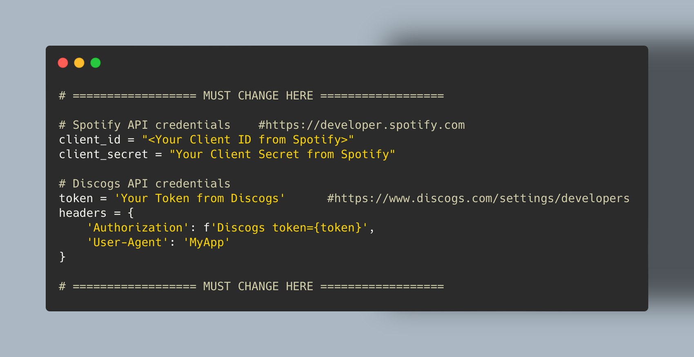
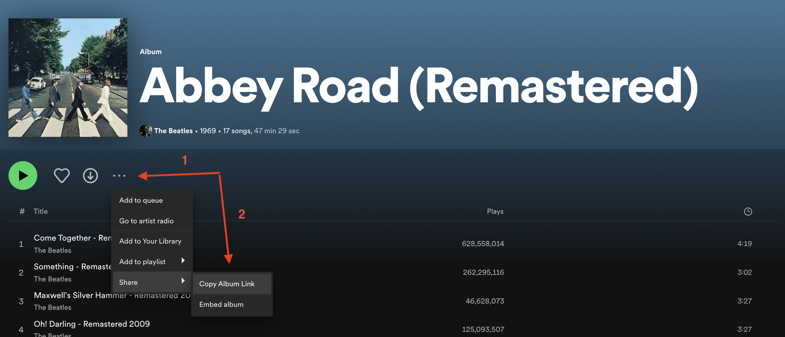
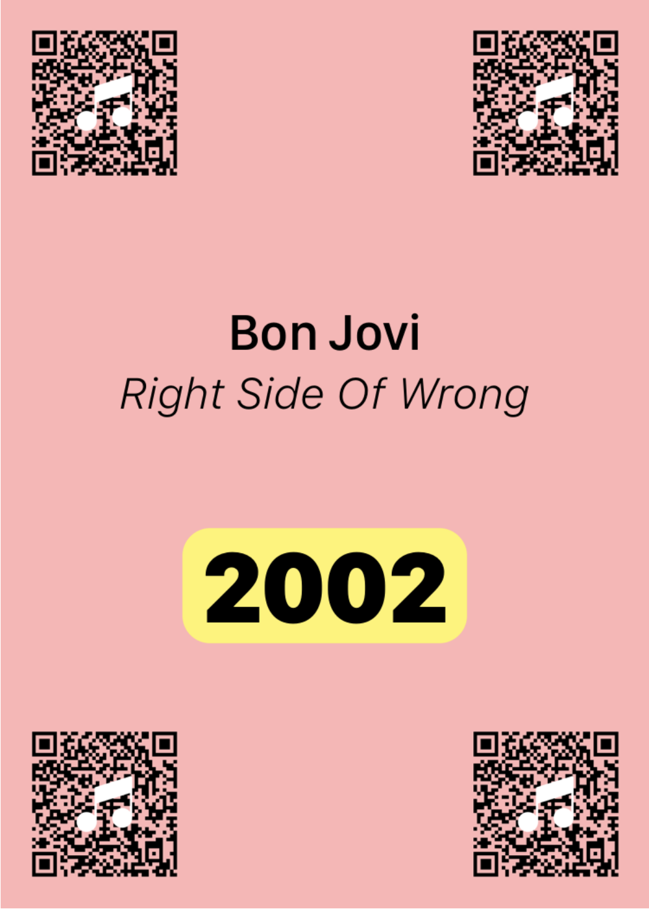
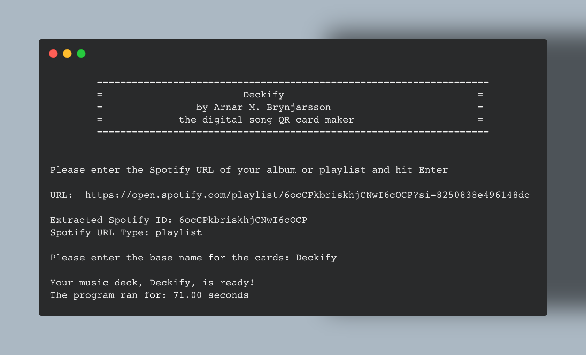

# DECKIFY QR CODE CARDS CREATOR

Welcome to Deckify, a program that helps you create digital cards from Spotify playlists or albums, inspired by the game Hitster. The cards contain the title, artist, and year of a song, along with a QR code. These cards can be printed and used to play a game where players draw a card, scan the QR code using a scanner, and open the song in Spotify. The challenge is to guess the release year of the song and place the card in the correct position on their timeline. 

Learn more about the game rules by referring to the [official Hitster rules](https://hitstergame.com/en-gb/how-to-play-premium/).

**Note:** This project is for educational purposes only and not intended for commercial use.

## Features

1. **Song Details**: Extract the title, artist, and year of the song.
2. **QR Code Generation**: Generate a QR code for each song.
3. **Customization**: Customize the appearance of your cards, including the background image and fonts.
4. **Integration with Multiple APIs**: Uses Spotify, Discogs, and MusicBrainz APIs to fetch detailed information about songs.

## Obtaining API Keys

Before you can use Deckify, you'll need to get API keys from Spotify and Discogs.

### Spotify API

1. Visit the [Spotify Developer Dashboard](https://developer.spotify.com/dashboard/).
2. Log in with your Spotify account or create a new one if you don't have one already.
3. After logging in, click on the "Create an App" button.
4. Provide a name and description for your app, accept the terms and conditions, and click "Create".
5. You will be directed to your app's dashboard where you can get your `Client ID` and `Client Secret`. These act as your API keys.

### Discogs API

1. Visit the [Discogs developer page](https://www.discogs.com/developers/).
2. If you don't have an account, create one and log in.
3. Once logged in, click on the "Developers" section in your profile.
4. Click on the "Create an Application" button.
5. Fill out the necessary details for your new application and click "Create".
6. After creation, you will be provided with a `Consumer Key` and `Consumer Secret`. These act as your API keys.

## Installation & Setup

1. Clone the GitHub repository to your local machine.
2. Navigate into the cloned repository.
3. Install the necessary dependencies using `pip install -r requirements.txt`.
4. Replace `'your_spotify_client_id_here'` and `'your_spotify_client_secret_here'` with your Spotify API client ID and secret.
5. Replace `'your_discogs_token_here'` with your Discogs API token.




## Requirements

- Python (3.x recommended, tested with Python 3.7)
- Required Python libraries:

```
spotipy==2.19.0
requests==2.26.0
Pillow==8.3.2 (Note: The `getsize` function is not supported in the newest release.)
qrcode==7.3
pandas
matplotlib
```

## How to Use

1. Copy the URL of a Spotify playlist or album.

2. Run the program and paste the URL into the program.

3. The program will analyze the URL, extract the ID, and prompt you for a deck name.

4. After naming the deck, the program will generate and save the cards with your custom name.




## Customizing Your Cards

- **Background Image**: Replace `background_image_path` with your desired image path.
- **QR Code Background Color**: Modify `QR_background_color` to your preferred color.
- **Fonts**: Specify the paths for custom fonts using `title_font_path`, `artist_font_path`, and `year_font_path`.

Ensure that all paths to custom fonts or images are correct. Incorrect paths may lead to errors.)




## Troubleshooting

1. **Incorrect Year**: The APIs might not always provide accurate details for all tracks and sometimes no year at all... (out of my hands - unfortunately!) 
2. **Pillow Library and getsize():** The newest release of PIL has a problem working with getsize, that's why an older version is installed. 

## Recommended QR Code Scanner

Use [QR Code Reader by 2Stable](https://apps.apple.com/is/app/qr-code-reader-2stable/id1593228108) for scanning the QR codes. Ensure 'Open Websites' is enabled in the app settings and that you have the Spotify app installed on your phone.




## Author

Developed by: Arnar Már Brynjarsson (c) 2023 Contact: `arnarrvk@gmail.com`
